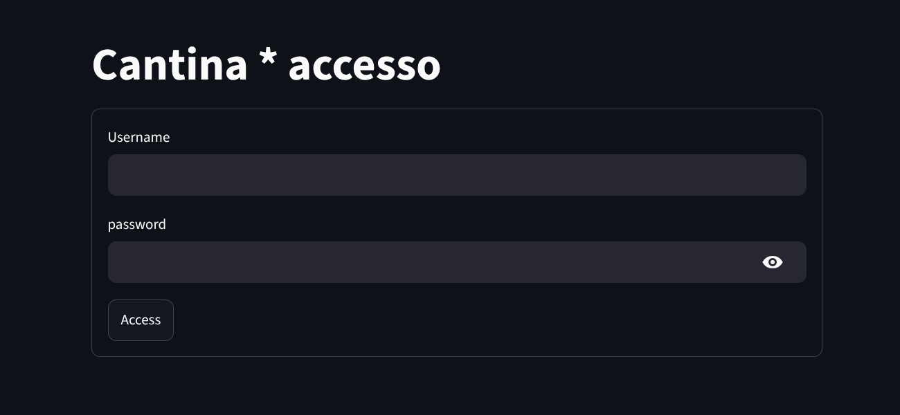
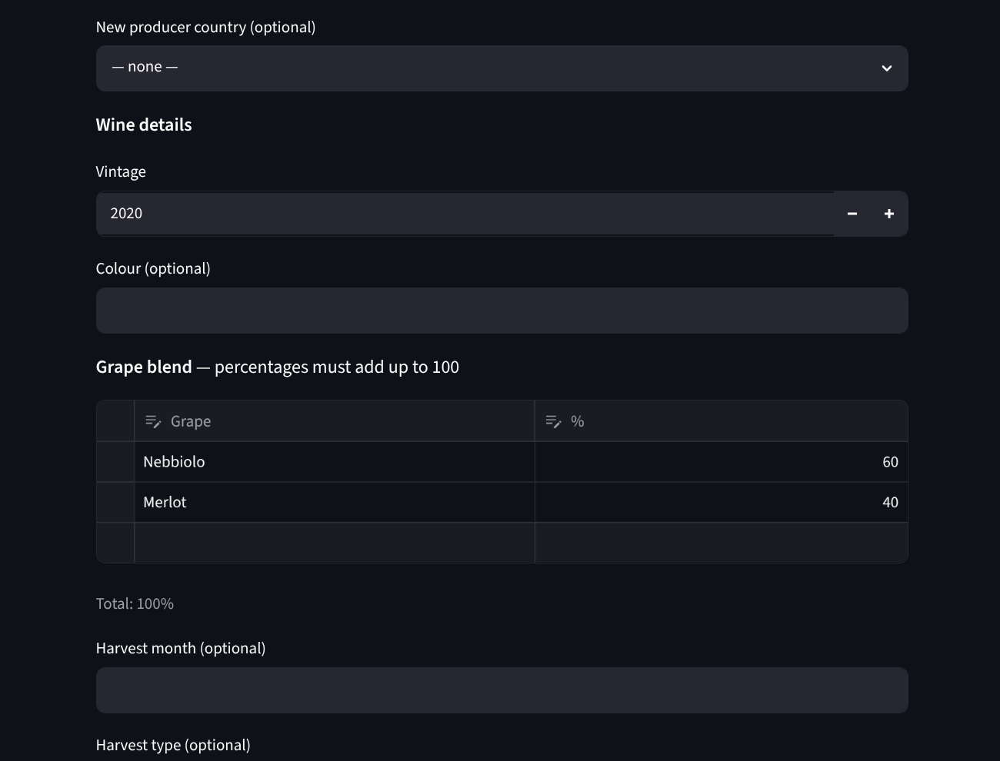
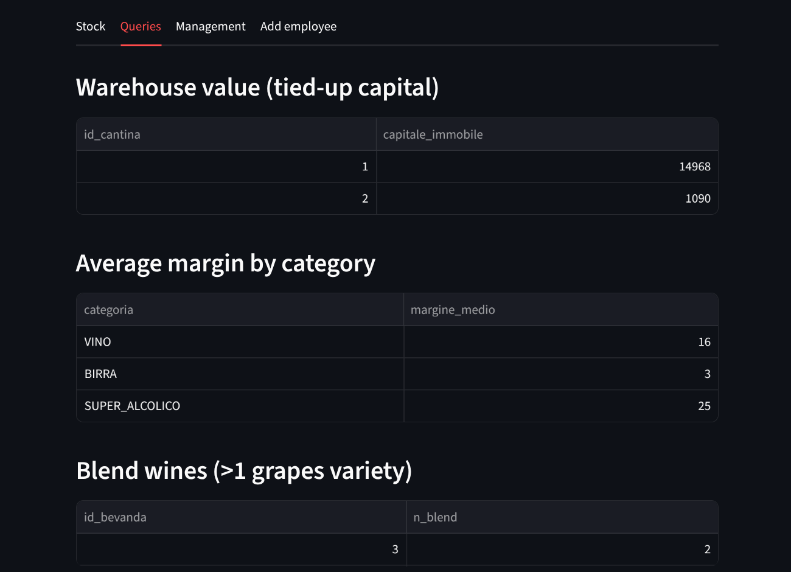
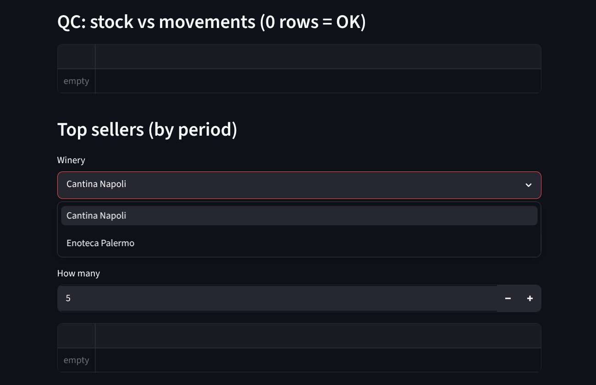

# 🍷 Cantina DB — demo walkthrough (UI guide)

Guided tour to **see the project running** from the Streamlit interface: per-role
login, row-scoped data consultation, and — most importantly — the **writes that
fire triggers and stored procedures live**.

> 🇮🇹 Versione italiana più sotto · [Italiano](#-guida-dimostrativa-versione-italiana)
>
> 📸 Screenshots live in `docs/screenshots/` and are embedded inline below.

---

## 0. Setup

> 🌐 **No install needed:** a hosted demo runs at <https://cantina-db.streamlit.app/>
> (first load may take ~30-60 s if the app was asleep). Skip to §0.3 for the
> credentials, then follow the tour from §1.

### 0.1 Load the database

From the repo root (see `README.md`):

```bash
sudo mariadb -e "CREATE DATABASE cantina CHARACTER SET utf8mb4 COLLATE utf8mb4_unicode_ci;"
mariadb -u <user> -p cantina < sql/01_schema.sql
mariadb -u <user> -p cantina < sql/02_triggers.sql
mariadb -u <user> -p cantina < sql/03_seed.sql
mariadb -u <user> -p cantina < sql/04_views.sql
mariadb -u <user> -p cantina < sql/05_queries_and_sp.sql
mariadb -u <user> -p cantina < sql/06_seed_azienda2.sql
sudo mariadb cantina < sql/07_grants.sql   # per-role MySQL users — run as root
```

Order matters: triggers (`02`) **before** the seed (`03`), because stock is not
hardcoded — it starts at 0 and the `follow_up` trigger builds it up as the seed
inserts the movements. And `07_grants.sql` runs **last, as root**: it creates one
least-privilege MySQL user per role (`cantina_login/titolare/magazziniere/cameriere`)
and needs views (`04`) and SPs (`05`) to already exist to grant on them.

### 0.2 Run the app

DB credentials live in `app/.streamlit/secrets.toml`, which now holds **one
section per role** (`login`, `titolare`, `magazziniere`, `cameriere`): the app
connects as the logged-in user's role, so the DB itself enforces what that role
may read/write (the passwords here must match `sql/07_grants.sql`). Then:

```bash
cd app
uv run streamlit run app.py
```

Opens on `http://localhost:8501`.



### 0.3 Demo credentials

Two companies, to show **per-company scoping**. Passwords are demo-only.

| Company | Username | Role | Password |
|---|---|---|---|
| Enoteca Adriatica | `g.bernardi` | owner | `cantina2026` |
| Enoteca Adriatica | `m.ferri` | warehouse | `cantina2026` |
| Enoteca Adriatica | `s.conti` | waiter | `cantina2026` |
| Enoteca Adriatica | `l.rossi` | warehouse (cellar 2) | `cantina2026` |
| Cantine del Sole | `m.verdi` | owner | `verdi123` |

---

## 1. Waiter — consultation (login: `s.conti`)

The simplest page: read-only, scoped to the waiter's own cellar.

| Step | Action | 🔎 What to observe |
|---|---|---|
| 1.1 | Log in as `s.conti`, tab **"Carta vini"** | You see **only** your cellar's wine list (view `v_carta_vini_cameriere`, filtered by `id_cantina`). |
| 1.2 | Tab **"Carta stampabile"** | The **printable wine list** stored procedure (`carta_vini_stampa`). |
| 1.3 | Tab **"Scheda tecnica"**, pick a wine from **"Wine"** | The **wine technical sheet** SP (`vino_tecnical_data`) recomposes the ISA hierarchy (beverage → wine → vinification → grapes → aging) in one shot. |

**Concept shown:** views as an *external schema* (each role sees only what it
needs) + Sec. 14 queries runnable from the app.


---

## 2. Warehouse — the operational core (login: `m.ferri`)

Here you see the **central mechanic**: register a movement and stock moves by
itself, kept consistent by triggers.

### 2.1 Stock & queries
- Tab **"Stock"**: your cellar's stock (view `v_giacenze_magazziniere`).
- Tab **"Queries"**: bottles under the average stock (reorder list), and
  never-sold beverages.

### 2.2 Register a movement → triggers `follow_up` + `oversell`

Tab **"Register movement"**:

| Step | Action | 🔎 What to observe |
|---|---|---|
| 2.2.1 | Register a **CARICO** (load) of N bottles of a listed beverage | Back on **Stock**: the quantity is **up by N**. You didn't write it — the `follow_up` `AFTER INSERT` trigger did. |
| 2.2.2 | Register a **VENDITA** (sale) of a few bottles | Stock **goes down**. |
| 2.2.3 | Try a **VENDITA larger than stock** | ❌ Error **"Bottiglie insufficienti"**: the `oversell` `BEFORE INSERT` trigger blocks the shortfall *before* writing. Stock never goes negative. |

> ℹ️ A fourth guard exists — loading a beverage **not in the cellar's price list** is
> rejected by `follow_up` with *"Carico su bevanda non presente nel listino della
> cantina"* instead of silently losing the stock. It cannot be triggered from the UI
> (the movement form only offers beverages already on the price list), so it is
> demonstrated via SQL in §5.

**Concept shown:** controlled redundancy (derived stock) kept by triggers;
non-negativity enforced at the model level.


### 2.3 Add a beverage to the price list

Tab **"Add to price list"**: add an existing beverage to your cellar's price list
(price, VAT, initial stock 0). From now on it can be loaded.

### 2.4 Create a never-seen beverage → SP `crea_bevanda` (atomic)

Tab **"New beverage"**. This is the abstraction layer: one action creates the full
beverage (parent + subtype + optionally a new producer), in a transaction.

| Step | Action | 🔎 What to observe |
|---|---|---|
| 2.4.1 | Category **BIRRA / SUPER_ALCOLICO / ANALCOLICO** | The "Wine details" fields **do not appear**: the right subtype is created by the SP. |
| 2.4.2 | Category **VINO** | Wine details and the **"Grape blend"** table appear. |
| 2.4.3 | Producer: pick **"➕ New producer…"** and type a name | The SP also creates the new producer in the same transaction. |
| 2.4.4 | **Grape blend**: add rows (e.g. `Nebbiolo 60`, `Merlot 40`) | The **"Total"** under the table must read **100%**. |
| 2.4.5 | Enter a blend that does **not** sum to 100 (e.g. 60 + 30) and press Create | ❌ Immediate UI error *and*, if forced, the SP would reject with **"Le percentuali dei vitigni devono sommare a 100"**. The DB is the source of truth. |
| 2.4.6 | Correct blend (100%) + Create | ✅ "Beverage created (id …)". The wine is born complete: `vino` + `vinificazione` (1:1) + the blend's grapes + optional aging. |

**Concept shown:** stored procedure as an **abstraction layer** between user and
logical model — the user sends the whole blend, the SP validates `= 100` and
writes it all atomically; the user never touches `vino_vitigno`.



---

## 3. Owner — company-wide view & permissions (login: `g.bernardi`)

### 3.1 Dashboard (tabs "Stock" + "Queries")
- **Stock**: stock of **all cellars of the owner's company** (view
  `v_giacenze_titolare`, filtered by `id_azienda`) — not the whole DB.
- **Queries**: warehouse value, average margin per category, blend wines, most
  active employee, QC redundancy (0 rows = triggers correct), and **top sellers**
  per cellar/period (parametrized SP `top_seller`).




### 3.2 Add an employee → SP `crea_dipendente` (server-side scoping)

Tab **"Add employee"**:

| Step | Action | 🔎 What to observe |
|---|---|---|
| 3.2.1 | The **"Winery"** menu shows **only your company's cellars** | UI-side scoping: you can't even select someone else's cellar. |
| 3.2.2 | Fill in and create a warehouse/waiter user | The password is **bcrypt-hashed in the app**; the SP receives the hash already, the DB never sees the plaintext. |
| 3.2.3 | (Defense in depth) The SP still checks that `id_cantina` belongs to your `id_azienda` | Even bypassing the UI, the server rejects with **"Cantina fuori dalla tua azienda"**. |


---

## 4. Per-company scoping (login: `m.verdi`)

Log out and back in as `m.verdi` (company **Cantine del Sole**).

| Step | 🔎 What to observe |
|---|---|
| 4.1 | The dashboard shows **only Cantina Napoli / Enoteca Palermo** — no Enoteca Adriatica data. |
| 4.2 | In "Add employee", the cellar menu contains **only** this company's two cellars. |

**Concept shown:** same pages, same code, fully separated data per company — both
in the UI and inside the SPs.



---

## 5. Trigger constraints not reachable from the UI (SQL bonus)

Some integrity constraints implemented as triggers don't (yet) have a dedicated
screen. Demonstrate them from a SQL client, in a transaction with `ROLLBACK` so
the data stays clean:

```sql
-- (t,d) generalization: a BIRRA beverage cannot land in the vino table
SET autocommit=0;
INSERT INTO produttore (nome,id_paese) VALUES ('X',1); SET @p:=LAST_INSERT_ID();
INSERT INTO bevanda (nome,categoria,id_produttore) VALUES ('X','BIRRA',@p); SET @b:=LAST_INSERT_ID();
INSERT INTO vino (id_bevanda) VALUES (@b);   -- ❌ 'Categoria incoerente: la bevanda non è VINO'
ROLLBACK;

-- Cellar coherence: a price-list entry from another cellar can't join a wine list
SET autocommit=0;
INSERT INTO carta_vini_voce (id_carta_vini, id_listino, ordine)
VALUES (1, 2, 99);   -- ❌ wine list in cellar 1, price-list entry in cellar 2
ROLLBACK;

-- Load on a beverage not in the cellar's price list (the §2.2 note): follow_up
-- rejects it instead of silently losing the stock
SET autocommit=0;
INSERT INTO movimenti (tipo, quantita_bottiglie, id_bevanda, id_dipendente, id_cantina)
VALUES ('CARICO', 5, 4, 2, 1);   -- ❌ bevanda 4 (Rioja) is listed only in cellar 2
ROLLBACK;

-- Grape percentage cap: the blend sum never exceeds 100.
-- Needs a wine with an empty blend: every seeded / SP-created wine already sums
-- to 100, so on those the FIRST insert below would already be rejected.
SET autocommit=0;
INSERT INTO produttore (nome) VALUES ('Y'); SET @p:=LAST_INSERT_ID();
INSERT INTO bevanda (nome,categoria,id_produttore) VALUES ('Y','VINO',@p); SET @b:=LAST_INSERT_ID();
INSERT INTO vino (id_bevanda) VALUES (@b);
INSERT INTO vino_vitigno (id_bevanda, id_vitigno, percentuale) VALUES (@b, 1, 60);
INSERT INTO vino_vitigno (id_bevanda, id_vitigno, percentuale) VALUES (@b, 2, 50); -- ❌ 110 > 100
ROLLBACK;
```

---

## 6. Summary — what the demo proves

| Course topic | Where you see it |
|---|---|
| External schema / per-role views | §1, §2.1, §3.1 (one view per role) |
| Controlled redundancy + triggers | §2.2 (stock derived by `follow_up`) |
| Procedural constraints (triggers) | §2.2.3 (`oversell`), §5 (`(t,d)`, wine list, unlisted load, grapes) |
| Transactions / atomicity | §2.4 (`crea_bevanda`), §3.2 (`crea_dipendente`) |
| Query stored procedures | §1.2, §2.1, §3.1 (the 10 Sec. 14 queries) |
| Application security | parameterized queries everywhere; bcrypt app-side (§3.2) |
| Role-based access design | UI + server-side scoping, per cellar and per company (§3, §4) |
| DB-level authorization | one least-privilege MySQL user per role; column/table `GRANT`/`REVOKE` (`sql/07_grants.sql`) |

### Known limits (declared)
- **Column/table** scoping is enforced at the DB level (per-role `GRANT`/`REVOKE`,
  `sql/07_grants.sql`); **row** scoping (`id_cantina`/`id_azienda`) is still passed
  by the app in the `WHERE`, because the MySQL user is **per-role, not per-employee**
  — two waiters of different cellars connect as the same `cantina_cameriere` user,
  so the DB can't tell them apart by `CURRENT_USER()`. True row-level security would
  need a user per employee (or `SECURITY DEFINER` SPs that read `USER()`).
- Onboarding a **new company** currently needs a DB super-user (not exposed in
  the UI).
- The exact `= 100` on the grape blend is enforced by the `crea_bevanda` SP; the
  `vino_vitigno` trigger is a safety net guaranteeing only `≤ 100` (exact equality
  isn't enforceable row-by-row without *deferred* constraints).

---

<a name="-guida-dimostrativa-versione-italiana"></a>
## 🇮🇹 Guida dimostrativa (versione italiana)

Percorso guidato per **vedere il progetto in funzione** dall'interfaccia
Streamlit: login per ruolo, consultazione dati filtrati, e — soprattutto — le
**scritture che fanno scattare trigger e stored procedure dal vivo**.

> 📸 Gli screenshot stanno in `docs/screenshots/` e sono inseriti inline qui sotto.

### 0. Preparazione

> 🌐 **Senza installare nulla:** una demo pubblica gira su
> <https://cantina-db.streamlit.app/> (il primo caricamento può richiedere ~30-60 s
> se l'app era in sleep). Salta a §0.3 per le credenziali, poi segui il tour dal §1.

#### 0.1 Carica il database

Dalla root del repo (vedi `README.md`):

```bash
sudo mariadb -e "CREATE DATABASE cantina CHARACTER SET utf8mb4 COLLATE utf8mb4_unicode_ci;"
mariadb -u <user> -p cantina < sql/01_schema.sql
mariadb -u <user> -p cantina < sql/02_triggers.sql
mariadb -u <user> -p cantina < sql/03_seed.sql
mariadb -u <user> -p cantina < sql/04_views.sql
mariadb -u <user> -p cantina < sql/05_queries_and_sp.sql
mariadb -u <user> -p cantina < sql/06_seed_azienda2.sql
sudo mariadb cantina < sql/07_grants.sql   # utenti MySQL per ruolo — da eseguire come root
```

L'ordine conta: i trigger (`02`) prima del seed (`03`), perché la **giacenza non
è scritta a mano** — parte da 0 e la costruisce il trigger `follow_up` man mano
che il seed inserisce i movimenti. E `07_grants.sql` va **per ultimo, come root**:
crea un utente MySQL a privilegio minimo per ruolo
(`cantina_login/titolare/magazziniere/cameriere`) e ha bisogno che viste (`04`) e
SP (`05`) esistano già per poter concedere i permessi su di esse.

#### 0.2 Avvia l'app

Le credenziali del DB stanno in `app/.streamlit/secrets.toml`, che ora contiene
**una sezione per ruolo** (`login`, `titolare`, `magazziniere`, `cameriere`):
l'app si connette con l'utente del ruolo loggato, quindi è il DB stesso a imporre
cosa quel ruolo può leggere/scrivere (le password qui devono combaciare con
`sql/07_grants.sql`). Poi:

```bash
cd app
uv run streamlit run app.py
```

Si apre il browser su `http://localhost:8501`.


#### 0.3 Credenziali demo

Due aziende, per mostrare lo **scoping per azienda**. Password solo dimostrative.

| Azienda | Username | Ruolo | Password |
|---|---|---|---|
| Enoteca Adriatica | `g.bernardi` | titolare | `cantina2026` |
| Enoteca Adriatica | `m.ferri` | magazziniere | `cantina2026` |
| Enoteca Adriatica | `s.conti` | cameriere | `cantina2026` |
| Enoteca Adriatica | `l.rossi` | magazziniere (cantina 2) | `cantina2026` |
| Cantine del Sole | `m.verdi` | titolare | `verdi123` |

### 1. Cameriere — consultazione (login: `s.conti`)

La pagina più semplice: sola lettura, filtrata sulla propria cantina.

| Passo | Azione | 🔎 Cosa osservare |
|---|---|---|
| 1.1 | Login come `s.conti`, tab **"Carta vini"** | Vedi **solo** la carta vini della *tua* cantina (vista `v_carta_vini_cameriere`, filtrata per `id_cantina`). |
| 1.2 | Tab **"Carta stampabile"** | La stored procedure della **carta vini pronta per la stampa** (`carta_vini_stampa`). |
| 1.3 | Tab **"Scheda tecnica"**, scegli un vino dal menu **"Wine"** | La SP **scheda tecnica** (`vino_tecnical_data`) ricompone la gerarchia ISA (bevanda → vino → vinificazione → vitigni → affinamento) in un colpo solo. |

**Concetto mostrato:** viste come *schema esterno* (ogni ruolo vede solo ciò che
gli compete) + query di Sez. 14 eseguibili dall'app.


### 2. Magazziniere — il cuore operativo (login: `m.ferri`)

Qui si vede la **meccanica centrale**: registri un movimento e la giacenza si
muove da sola, mantenuta coerente dai trigger.

#### 2.1 Stock e query
- Tab **"Stock"**: giacenze della tua cantina (vista `v_giacenze_magazziniere`).
- Tab **"Queries"**: bevande sotto la giacenza media (lista riordino) e bevande
  mai vendute.

#### 2.2 Registra un movimento → trigger `follow_up` + `oversell`

Tab **"Register movement"**:

| Passo | Azione | 🔎 Cosa osservare |
|---|---|---|
| 2.2.1 | Registra un **CARICO** di N bottiglie di una bevanda a listino | Torna su **Stock**: la giacenza è **aumentata di N**. Non l'hai scritta tu — l'ha fatto il trigger `follow_up` `AFTER INSERT`. |
| 2.2.2 | Registra una **VENDITA** di poche bottiglie | La giacenza **cala**. |
| 2.2.3 | Prova una **VENDITA più grande della giacenza** | ❌ Errore **"Bottiglie insufficienti"**: il trigger `oversell` `BEFORE INSERT` blocca lo scoperto *prima* di scrivere. La giacenza non va mai negativa. |

> ℹ️ Esiste una quarta guardia — il carico di una bevanda **non a listino** della
> cantina viene respinto da `follow_up` con *"Carico su bevanda non presente nel
> listino della cantina"* invece di perdere la giacenza in silenzio. Non è
> raggiungibile dalla UI (il form movimenti propone solo bevande già a listino):
> si dimostra via SQL nel §5.

**Concetto mostrato:** ridondanza controllata (giacenza derivata) mantenuta da
trigger; vincolo di non-negatività imposto a livello di modello.


#### 2.3 Aggiungi una bevanda a listino

Tab **"Add to price list"**: aggiungi una bevanda esistente al listino della tua
cantina (prezzo, IVA, giacenza iniziale 0). Da questo momento la puoi caricare.

#### 2.4 Crea una bevanda mai vista → SP `crea_bevanda` (atomica)

Tab **"New beverage"**. È il layer di astrazione: una sola azione crea la
bevanda completa (padre + sottotipo + eventuale produttore nuovo), in transazione.

| Passo | Azione | 🔎 Cosa osservare |
|---|---|---|
| 2.4.1 | Categoria **BIRRA / SUPER_ALCOLICO / ANALCOLICO** | I campi "Wine details" **non compaiono**: il sottotipo giusto viene creato dalla SP. |
| 2.4.2 | Categoria **VINO** | Appaiono i dettagli vino e la tabella **"Grape blend"**. |
| 2.4.3 | Produttore: scegli **"➕ New producer…"** e inserisci un nome | La SP crea *anche* il produttore nuovo nella stessa transazione. |
| 2.4.4 | **Grape blend**: aggiungi righe (es. `Nebbiolo 60`, `Merlot 40`) | Il **"Total"** sotto la tabella deve fare **100%**. |
| 2.4.5 | Metti un blend che **non** somma 100 (es. 60 + 30) e premi Create | ❌ Errore immediato lato UI *e*, se lo forzassi, la SP rifiuterebbe con **"Le percentuali dei vitigni devono sommare a 100"**. Il DB è la fonte di verità. |
| 2.4.6 | Blend corretto (100%) + Create | ✅ "Beverage created (id …)". Il vino è nato completo: `vino` + `vinificazione` (1:1) + i vitigni del blend + affinamento opzionale. |

**Concetto mostrato:** stored procedure come **layer di astrazione** tra utente e
modello logico — l'utente manda il blend intero, la SP valida `= 100` e scrive
tutto atomicamente; l'utente non tocca mai la tabella `vino_vitigno`.


### 3. Titolare — visione d'azienda e permessi (login: `g.bernardi`)

#### 3.1 Dashboard (tab "Stock" + "Queries")
- **Stock**: giacenze di **tutte le cantine della propria azienda** (vista
  `v_giacenze_titolare`, filtrata per `id_azienda`) — non dell'intero DB.
- **Queries**: valore di magazzino, margine medio per categoria, vini blend,
  dipendente più attivo, QC ridondanza (0 righe = trigger corretti), e i
  **top seller** per cantina/periodo (SP parametrica `top_seller`).


#### 3.2 Aggiungi un dipendente → SP `crea_dipendente` (scoping lato server)

Tab **"Add employee"**:

| Passo | Azione | 🔎 Cosa osservare |
|---|---|---|
| 3.2.1 | Il menu **"Winery"** mostra **solo le cantine della tua azienda** | Scoping lato UI: non puoi nemmeno selezionare una cantina altrui. |
| 3.2.2 | Compila e crea un magazziniere/cameriere | La password viene **hashata con bcrypt nell'app**; la SP riceve già l'hash, il DB non vede mai il testo in chiaro. |
| 3.2.3 | (Difesa in profondità) La SP controlla comunque che `id_cantina` appartenga alla tua `id_azienda` | Anche aggirando la UI, il server rifiuta con **"Cantina fuori dalla tua azienda"**. |


### 4. Scoping per azienda (login: `m.verdi`)

Esci e rientra come `m.verdi` (azienda **Cantine del Sole**).

| Passo | 🔎 Cosa osservare |
|---|---|
| 4.1 | La dashboard mostra **solo Cantina Napoli / Enoteca Palermo** — nessun dato di Enoteca Adriatica. |
| 4.2 | In "Add employee", il menu cantine contiene **solo** le due cantine di questa azienda. |

**Concetto mostrato:** stesse pagine, stesso codice, dati completamente separati
per azienda — sia in UI sia lato SP.


### 5. Vincoli via trigger non raggiungibili dalla UI (bonus SQL)

Alcuni vincoli di integrità implementati come trigger non hanno (ancora) una
schermata dedicata. Si dimostrano da client SQL, in transazione con `ROLLBACK`
per non sporcare i dati:

```sql
-- (t,d) generalizzazione: una bevanda BIRRA non può finire nella tabella vino
SET autocommit=0;
INSERT INTO produttore (nome,id_paese) VALUES ('X',1); SET @p:=LAST_INSERT_ID();
INSERT INTO bevanda (nome,categoria,id_produttore) VALUES ('X','BIRRA',@p); SET @b:=LAST_INSERT_ID();
INSERT INTO vino (id_bevanda) VALUES (@b);   -- ❌ 'Categoria incoerente: la bevanda non è VINO'
ROLLBACK;

-- Coerenza cantina: una voce di listino di un'altra cantina non entra in una carta vini
SET autocommit=0;
INSERT INTO carta_vini_voce (id_carta_vini, id_listino, ordine)
VALUES (1, 2, 99);   -- ❌ carta in cantina 1, listino in cantina 2
ROLLBACK;

-- Carico su bevanda non a listino della cantina (la nota di §2.2): follow_up
-- lo respinge invece di perdere la giacenza in silenzio
SET autocommit=0;
INSERT INTO movimenti (tipo, quantita_bottiglie, id_bevanda, id_dipendente, id_cantina)
VALUES ('CARICO', 5, 4, 2, 1);   -- ❌ la bevanda 4 (Rioja) è a listino solo in cantina 2
ROLLBACK;

-- Tetto percentuali: la somma dei vitigni non supera 100.
-- Serve un vino con blend vuoto: ogni vino del seed / creato dalla SP somma già
-- a 100, quindi su quelli verrebbe respinto già il PRIMO insert qui sotto.
SET autocommit=0;
INSERT INTO produttore (nome) VALUES ('Y'); SET @p:=LAST_INSERT_ID();
INSERT INTO bevanda (nome,categoria,id_produttore) VALUES ('Y','VINO',@p); SET @b:=LAST_INSERT_ID();
INSERT INTO vino (id_bevanda) VALUES (@b);
INSERT INTO vino_vitigno (id_bevanda, id_vitigno, percentuale) VALUES (@b, 1, 60);
INSERT INTO vino_vitigno (id_bevanda, id_vitigno, percentuale) VALUES (@b, 2, 50); -- ❌ 110 > 100
ROLLBACK;
```

### 6. Riepilogo — cosa dimostra la demo

| Argomento del corso | Dove si vede |
|---|---|
| Schema esterno / viste per ruolo | §1, §2.1, §3.1 (una vista per ruolo) |
| Ridondanza controllata + trigger | §2.2 (giacenza derivata da `follow_up`) |
| Vincoli procedurali (trigger) | §2.2.3 (`oversell`), §5 (`(t,d)`, carta-vini, carico non a listino, vitigni) |
| Transazioni / atomicità | §2.4 (`crea_bevanda`), §3.2 (`crea_dipendente`) |
| Stored procedure di interrogazione | §1.2, §2.1, §3.1 (le 10 query di Sez. 14) |
| Sicurezza applicativa | query parametrizzate ovunque; bcrypt lato app (§3.2) |
| Progettazione di accesso per ruolo | scoping UI + lato server, per cantina e per azienda (§3, §4) |
| Autorizzazione lato DB | un utente MySQL a privilegio minimo per ruolo; `GRANT`/`REVOKE` per colonna/tabella (`sql/07_grants.sql`) |

#### Limiti noti (dichiarati)
- Lo scoping per **colonna/tabella** è imposto a livello DB (`GRANT`/`REVOKE` per
  ruolo, `sql/07_grants.sql`); lo scoping per **riga** (`id_cantina`/`id_azienda`)
  lo passa ancora l'app nel `WHERE`, perché l'utente MySQL è **per ruolo, non per
  dipendente** — due camerieri di cantine diverse si connettono con lo stesso
  utente `cantina_cameriere`, quindi il DB non può distinguerli via
  `CURRENT_USER()`. Una vera row-level security richiederebbe un utente per
  dipendente (o SP `SECURITY DEFINER` che leggono `USER()`).
- L'onboarding di una **nuova azienda** richiede oggi un super-user da database
  (non esposto in UI).
- Il `= 100` esatto sul blend vitigni è imposto dalla SP `crea_bevanda`; il
  trigger `vino_vitigno` fa da rete di sicurezza garantendo solo `≤ 100`
  (l'uguaglianza esatta non è imponibile riga-per-riga senza vincoli *deferred*).
