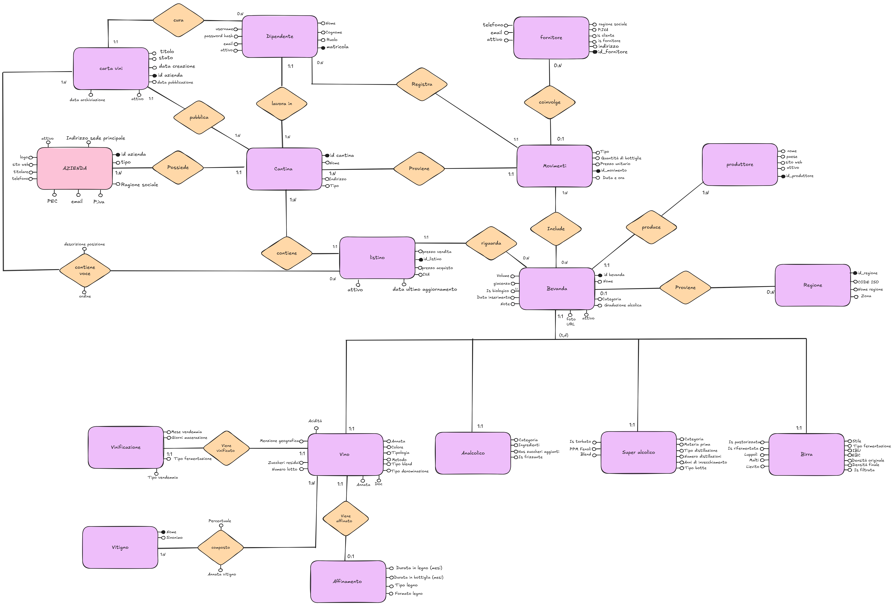

# 🍷 Cantina DB — winery & beverage storage management

*Relational database and small management app for a winery: global beverage
catalog, per-cellar stock, load/unload movements with **stock derived and kept
consistent by triggers**, wine lists, and role-based employee access.*

> 🇮🇹 Versione italiana più sotto · [Italiano](#-versione-italiana)

Born as a coursework project for **Databases** (University of Trieste) and
extended with a working demo application.

> ▶ **Want to try it?** Step-by-step UI walkthrough (with triggers/SPs live) in
> [`DEMO.md`](DEMO.md).

---

## Domain in a nutshell

A **company** (`azienda`) owns one or more **cellars** (`cantina`). Each cellar's
**employees** (`dipendente`) record stock **movements** (`movimenti`) — load,
unload, sale, purchase — on **beverages** (`bevanda`) from a global catalog.
From loads minus unloads we derive the **stock** (`giacenza`), which is an
attribute of the **price list** (`listino`, the beverage-cellar pair). Each
cellar publishes **wine lists** (`carta_vini`).

A beverage specializes — total, exclusive generalization `(t,d)` — into **wine**,
**beer**, **spirit**, **soft drink**; wines model grape varieties (N:M blend),
vinification and aging.

> **Note:** table and column names are in Italian on purpose — they match the
> design document (`docs/progettazione.md`), which is the graded deliverable.

Full E-R schema and design rationale in
[`docs/progettazione.en.md`](docs/progettazione.en.md).



*(vector version: [`docs/er.svg`](docs/er.svg) · [editable source on Excalidraw](https://excalidraw.com/#json=0z3IDkIiYpeIeiCDvoeLV,dG9b43487-mfvA6bvlXb-w))*

## Technical highlights

- **3NF schema**, verified, with two *deliberate, documented* denormalizations
  (stored stock, `id_cantina` on movements) justified by a volume/operations
  analysis.
- **Triggers** keep stock consistent and forbid negative quantities.
- **Views** as an external schema: each role (waiter, warehouse, owner) sees only
  what it needs.
- **10 example queries** as stored procedures (joins, aggregations, subqueries),
  each tied back to a design choice (Sec. 14) and **runnable in-app** via a
  per-role toggle.
- **Streamlit demo**: employee login, per-cellar stock and wine-list consultation
  (row-scoped to the employee's own cellar), stock-movement registration, atomic
  catalog writes (new beverage / price-list entry) and owner-side employee creation
  — all scoped to the user's company both in the UI and server-side in the procedures.

## Stack

| Component | Technology |
|---|---|
| DBMS | MariaDB 10.6+ (InnoDB, utf8mb4) |
| App | Python + Streamlit |
| DB access | parameterized queries (SQL-injection safe) |

## Repo layout

```
cantina-db/
├── sql/
│   ├── 01_schema.sql      # DDL: tables, constraints, indexes
│   ├── 02_triggers.sql    # stock maintenance (follow_up) + oversell guard
│   ├── 03_seed.sql        # realistic sample data (stock derived via triggers)
│   ├── 04_views.sql       # per-role views (warehouse / owner / waiter)
│   ├── 05_queries_and_sp.sql  # 10 example queries + app write procedures (all stored procedures)
│   └── 06_seed_azienda2.sql   # second company (demo data for per-company scoping)
├── app/                   # Streamlit application
│   ├── db.py              # connection + query/write helpers
│   ├── auth.py            # employee login
│   ├── forms.py           # write forms (movement / price-list / new beverage / new employee)
│   ├── pages.py           # per-role pages (owner / warehouse / waiter)
│   └── app.py             # entry point: login gate, session, role routing
├── docs/
│   ├── progettazione.md   # design document IT (requirements -> logical -> 3NF -> physical -> triggers)
│   ├── progettazione.en.md# design document EN
│   └── er.svg / er.png    # E-R schema
└── README.md
```

## Quick start

```bash
# 1. create the database (as root)
sudo mariadb -e "CREATE DATABASE cantina CHARACTER SET utf8mb4 COLLATE utf8mb4_unicode_ci;"

# 2. load the SQL files in numeric order
mariadb -u <user> -p cantina < sql/01_schema.sql
mariadb -u <user> -p cantina < sql/02_triggers.sql
mariadb -u <user> -p cantina < sql/03_seed.sql
mariadb -u <user> -p cantina < sql/04_views.sql
mariadb -u <user> -p cantina < sql/05_queries_and_sp.sql   # stored procedures (queries + app writes)
mariadb -u <user> -p cantina < sql/06_seed_azienda2.sql    # second company (scoping demo)
```

### Demo credentials

Two companies, to show per-company scoping. Passwords are demo-only.

| Company | Username | Role | Password |
|---|---|---|---|
| Enoteca Adriatica | `g.bernardi` | owner | `cantina2026` |
| Enoteca Adriatica | `m.ferri` | warehouse | `cantina2026` |
| Enoteca Adriatica | `s.conti` | waiter | `cantina2026` |
| Enoteca Adriatica | `l.rossi` | warehouse (cellar 2) | `cantina2026` |
| Cantine del Sole | `m.verdi` | owner | `verdi123` |

> ℹ️ The numeric order is significant: triggers (`02`) load **before** the seed
> (`03`) because stock (`giacenza`) is not hardcoded — it starts at 0 and is built
> up by the `follow_up` trigger as the seed inserts the movements.

## Status

🚧 Work in progress — schema, triggers, all three per-role views and the 10 example
queries (stored procedures) complete and validated on MariaDB; the design document
(IT + EN) is complete. The Streamlit app has employee login and a per-role page
(owner / warehouse / waiter), each **row-scoped to its own cellar** and able to run
its Sec. 14 stored-procedure queries via a toggle. The app now **writes**:
movement registration (load/sale → stock kept live by the triggers, oversell surfaced
to the user), price-list entries, atomic new-beverage creation (`crea_bevanda`, Sec. 14.3)
and owner-side employee creation (`crea_dipendente`, Sec. 14.4) scoped to the owner's
company. The app is **split into modules** (`db`/`auth`/`forms`/`pages`/`app`) and a second
company (`06_seed_azienda2.sql`) demonstrates per-company scoping. All **integrity triggers**
of docs Sec. 13.2 are in place: generalization `(t,d)` coherence, wine-list ↔ price-list cellar
consistency, and the grape-blend cap (with exact `= 100%` enforced by `crea_bevanda`, which now
takes the whole blend as JSON). Still to come: the GRANT/REVOKE role demo (and new-company
onboarding, currently DBA-only).

## Roadmap / future work

- **Warehouse editing.** The warehouse role gets `UPDATE`/`DELETE` on its own price
  list (`listino`) — fix a price, or retire a beverage via soft-delete
  (`attivo = FALSE`). Stock **movements stay an append-only ledger**: a mistake is
  corrected by posting a compensating movement (*storno*), not by rewriting history.
  This keeps the trigger-maintained `giacenza` consistent with **no extra
  `UPDATE`/`DELETE` triggers** on `movimenti`.
- **Precise movement editing (planned).** A later iteration will re-implement the
  ledger from *append-only* to **directly editable**: `UPDATE`/`DELETE` on
  `movimenti` backed by delta-maintaining `BEFORE/AFTER UPDATE` and `DELETE` triggers
  that re-apply the oversell guard and the non-negative-stock constraint on every path.
- **Authorization model — known limitation (rework needed).** Access control is
  currently split across three layers that are only *loosely* coordinated: column
  scoping in the per-role views, row scoping passed by the app (`WHERE id_cantina/
  id_azienda = …`), and per-role `GRANT`/`REVOKE`. Because row-level tenant filtering
  lives in the application (per-role — not per-employee — DB users + a fresh connection
  per query rule out `CURRENT_USER()`/session-variable enforcement in the DB, since
  `CURRENT_USER()` identifies only the role), a bug or a bypassed `WHERE` clause can
  leak cross-tenant data. This pipeline is **held together by convention, not by a
  single enforced policy**, and should be reworked into one coherent responsibility
  boundary (e.g. per-employee DB identities with persistent connections, or a
  security-definer SP layer that owns *all* row filtering). For the current scope it is
  *good enough* — **good enough beats perfect here** — but it is a deliberate,
  documented weak point, not a finished design.
- **Automated tests.** No test suite yet; add one (`uv add --dev pytest`) covering the
  auth layer, the per-role/tenant row-scoping, and the trigger/oversell paths.

---

<a name="-versione-italiana"></a>
## 🇮🇹 Versione italiana

Database relazionale e piccolo gestionale per una **azienda vinicola**: catalogo
bevande globale, magazzino per cantina, movimenti di carico/scarico con
**giacenza derivata e mantenuta coerente dai trigger**, carte vini e gestione dei
dipendenti con permessi per ruolo.

Nato come elaborato per il corso di **Basi di Dati** (Università di Trieste) ed
esteso con una demo applicativa funzionante.

> ▶ **Vuoi provarlo?** Guida passo-passo all'interfaccia (con trigger/SP dal vivo)
> in [`DEMO.md`](DEMO.md).

### Dominio in breve

Un'**azienda** possiede una o più **cantine**. In ogni cantina i **dipendenti**
registrano i **movimenti** di magazzino (carico, scarico, vendita, acquisto)
sulle **bevande** del catalogo globale. Da carichi − scarichi si deriva la
**giacenza**, attributo del **listino** (la coppia bevanda-cantina). Ogni cantina
pubblica delle **carte vini**.

La bevanda si specializza — generalizzazione totale ed esclusiva `(t,d)` — in
**vino**, **birra**, **superalcolico**, **analcolico**; del vino si modellano
vitigni (blend N:M), vinificazione e affinamento.

Schema E-R completo e scelte di progetto in
[`docs/progettazione.md`](docs/progettazione.md) e [`docs/er.svg`](docs/er.svg)
([sorgente modificabile su Excalidraw](https://excalidraw.com/#json=0z3IDkIiYpeIeiCDvoeLV,dG9b43487-mfvA6bvlXb-w)).

### Caratteristiche tecniche

- **Schema 3NF** verificato, con due denormalizzazioni *deliberate e documentate*
  (giacenza memorizzata, `id_cantina` sui movimenti) motivate dall'analisi di
  volumi/operazioni.
- **Trigger** per mantenere la giacenza coerente e impedire scorte negative.
- **Viste** come schema esterno: ogni ruolo (cameriere, magazziniere, titolare)
  vede solo ciò che gli compete.
- **10 query di esempio** come stored procedure (join, aggregazioni, subquery),
  ciascuna agganciata a una scelta di progetto (Sez. 14) ed **eseguibili
  nell'app** tramite un toggle per ruolo.
- **Demo Streamlit**: login per dipendente, consultazione giacenze e carte vini,
  registrazione movimenti, scritture atomiche sul catalogo (nuova bevanda / voce di
  listino) e creazione dipendenti lato titolare — tutto filtrato sull'azienda
  dell'utente, sia in UI sia lato server nelle procedure.

### Stato

🚧 In sviluppo — schema, trigger, tutte e tre le viste per ruolo e le 10 query di
esempio (stored procedure) completi e validati su MariaDB; il documento di
progettazione (IT + EN) è completo. L'app Streamlit ha il login dipendente e una
pagina per ruolo (titolare / magazziniere / cameriere), ciascuna **filtrata sulla
propria cantina** e con le query stored-procedure della Sez. 14 eseguibili tramite
toggle. L'app ora **scrive**: registrazione movimenti (carico/vendita → giacenza
aggiornata dai trigger, oversell mostrato all'utente), aggiunta a listino, creazione
atomica di una bevanda nuova (`crea_bevanda`, Sez. 14.3) e creazione dipendenti lato
titolare (`crea_dipendente`, Sez. 14.4) filtrata sull'azienda. L'app è **divisa in
moduli** (`db`/`auth`/`forms`/`pages`/`app`) e una seconda azienda
(`06_seed_azienda2.sql`) dimostra lo scoping per azienda. Tutti i **trigger di integrità**
del documento Sez. 13.2 sono implementati: coerenza della generalizzazione `(t,d)`, coerenza di
cantina fra carta vini e listino, e il tetto sul blend di vitigni (con l'uguaglianza esatta
`= 100%` imposta da `crea_bevanda`, che ora riceve il blend intero come JSON). Ancora da fare:
la demo dei permessi GRANT/REVOKE (e l'onboarding di una nuova azienda, per ora solo via DBA).

### Roadmap / sviluppi futuri

- **Modifica magazzino.** Il ruolo magazziniere ottiene `UPDATE`/`DELETE` sul proprio
  listino (`listino`) — correggere un prezzo o ritirare una bevanda via soft-delete
  (`attivo = FALSE`). I **movimenti restano un registro append-only**: un errore si
  corregge registrando un movimento di compensazione (*storno*), non riscrivendo lo
  storico. Così la `giacenza` mantenuta dai trigger resta coerente **senza alcun
  trigger `UPDATE`/`DELETE`** sui `movimenti`.
- **Modifica puntuale dei movimenti (previsto).** Un'iterazione successiva
  reimplementerà il registro da *append-only* a **direttamente modificabile**:
  `UPDATE`/`DELETE` su `movimenti` con trigger `BEFORE/AFTER UPDATE` e `DELETE` che
  mantengono la giacenza sul delta, riapplicando il controllo di oversell e il
  vincolo di scorta non negativa su ogni percorso.
- **Modello di autorizzazione — limite noto (da rifare).** Il controllo accessi è
  oggi spalmato su tre livelli coordinati solo *debolmente*: scoping per colonne nelle
  viste per ruolo, scoping per righe passato dall'app (`WHERE id_cantina/id_azienda =
  …`) e `GRANT`/`REVOKE` per ruolo. Poiché il filtro tenant a livello di riga vive
  **nell'applicazione** (utenti DB per ruolo — non per singolo dipendente — + una nuova
  connessione a ogni query rendono impossibile l'enforcement lato DB con
  `CURRENT_USER()`/variabili di sessione, dato che `CURRENT_USER()` identifica solo il
  ruolo), un bug o un `WHERE` saltato può causare un **leak cross-tenant**. Questa
  pipeline **sta in piedi per convenzione, non per un'unica policy imposta**, e andrebbe
  rifatta in un solo confine di responsabilità coerente (es. identità DB per singolo
  dipendente con connessioni persistenti, oppure uno strato di SP `SECURITY DEFINER`
  che possiede *tutto* il filtro di riga). Per lo scope attuale è *good enough* —
  **good enough is better than perfect** qui — ma è un punto debole deliberato e
  documentato, non un design finito.
- **Test automatici.** Nessuna suite di test ancora; aggiungerne una
  (`uv add --dev pytest`) che copra lo strato di autenticazione, lo scoping per riga
  (ruolo/tenant) e i percorsi trigger/oversell.

> ℹ️ L'ordine numerico è significativo: i trigger (`02`) si caricano **prima** del
> seed (`03`) perché la giacenza non è scritta a mano — parte da 0 e viene costruita
> dal trigger `follow_up` man mano che il seed inserisce i movimenti.
