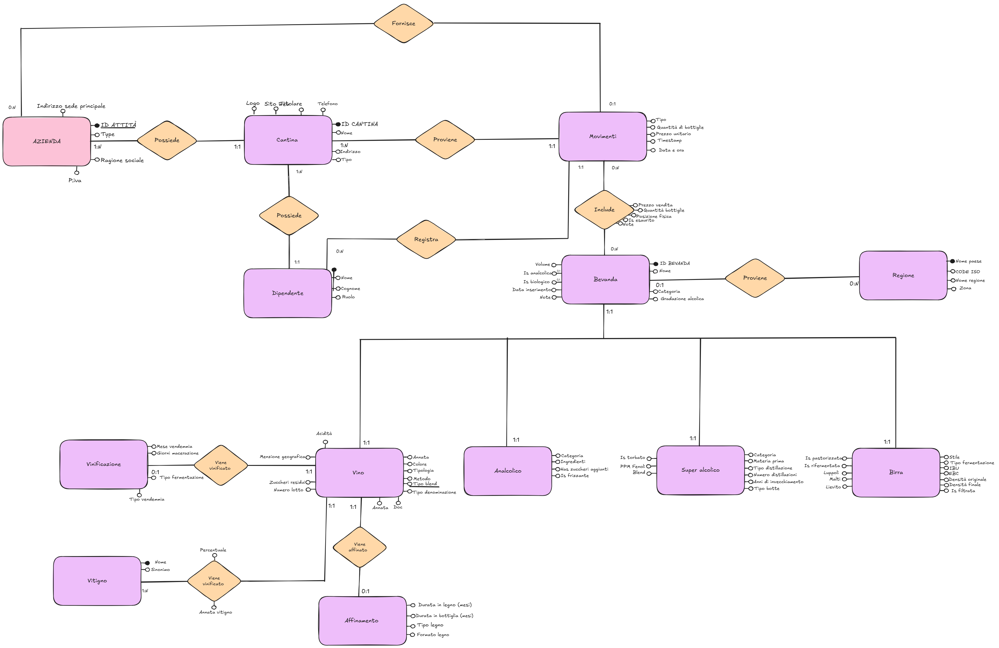

# Design document — Conceptual design

> English translation of `progettazione.md`. Entity, attribute and relationship
> names are kept in Italian on purpose: they are the identifiers used by the
> schema (`sql/01_schema.sql`) and the graded deliverable.

Management system for wineries (*cantine*) and beverage storage.

---

## 1. Requirements in natural language

The proposed product is a management software for wineries: it positions itself
as a single tool for archiving and managing everything related to beverage
storage. The client company using the product gets a management system for its
own cellars, which keeps track of the employees working there and guarantees
traceability and history of the operations performed on the products.

The main object of management is beverage storage. For each beverage we consider
the type — wine, beer, soft drink or spirit — and the region of origin; for wines
we additionally record specific technical details, such as the grape variety,
the vinification and the aging.

Finally, the system manages warehouse movements: from load and unload movements
the available quantity (stock, *giacenza*) of each beverage is derived. Both
internal movements and external ones, such as supplies, are tracked. On the sales
side, each cellar has one or more wine lists, each collecting a set of beverages
put on offer with their related sales data (such as the price).

---

## 2. Glossary of terms

| Term | Definition | Synonyms / not to be confused with | Links | Frequency |
|---|---|---|---|---|
| Azienda | Client of the system, usually a company | Business/activity (alias); != Produttore and != Fornitore | Cantina | — |
| Cantina | Physical place where products are stored | — | Azienda, Carta vini, Dipendente, Movimento, Listino | — |
| Carta vini | A particular selection of beverages on sale, with their commercial data | = menu/catalog; contains Listino entries | Cantina, Listino, Dipendente | — |
| Listino | Entity with the commercial data of a beverage in a cellar | A standalone entity (NOT attributes of Bevanda); holds both sale price and purchase price | Carta vini, Bevanda, Cantina | — |
| Dipendente | System user with the power to modify it (operator) | = user enabled to modify the system; != customer/consumer (who has no access) | Cantina, Movimento, Carta vini | — |
| Bevanda | Generic stored and managed product (global catalog) | = product; quantities expressed in bottles; stock is NOT an attribute of it but of the Listino (relative to the beverage-cellar pair) | Regione, Produttore, Movimento, Listino, Vino, Birra, Analcolico, Superalcolico | — |
| Vino | Alcoholic beverage obtained from grape fermentation | — | Bevanda, Vitigno, Vinificazione, Affinamento | — |
| Birra | Alcoholic beverage from the fermentation of malt and hops | — | Bevanda | — |
| Analcolico | Generic non-alcoholic beverage | — | Bevanda | — |
| Superalcolico | Spirit or beverage over 20 degrees | — | Bevanda | — |
| Vitigno | Grape variety a wine is made from | = grape / variety | Vino | — |
| Vinificazione | Process turning grapes into wine | != Affinamento != aging (distinct phases) | Vino | — |
| Affinamento | Wine maturation phase after vinification (e.g. in cask or bottle) | != Vinificazione (which precedes it) | Vino | — |
| Regione | Geographic origin of a beverage | Provenance; for wines != denomination (DOC/DOCG) | Bevanda | — |
| Produttore | Who makes the beverage | != Fornitore (who supplies movements); != Azienda (the client) | Bevanda | — |
| Fornitore | Who supplies purchase movements (may also be a customer) | != Produttore (who manufactures); != Azienda | Movimento | — |
| Movimento | Record of a transfer, sale or acquisition of bottles and its value | = operation; load/unload = movement types (sale = unload, supply/acquisition = load); load price != sale price | Bevanda, Giacenza, Dipendente, Cantina, Fornitore | ~3/day (per cellar) |
| Giacenza | Available quantity of a beverage in a cellar, in bottles. Attribute of the **Listino** (beverage-cellar pair), **derived** from movements (loads - unloads), stored for efficiency and kept consistent via triggers | = stock / inventory / availability | Listino, Movimento | — |
| Fornitura | An external purchase movement (NOT an entity: it is a Movimento of type ACQUISTO with a Fornitore) | != Produttore (who manufactures) and != Fornitore (who supplies) | Movimento, Fornitore | ~1-2/week (per cellar) |

> **Frequency note.** Frequencies are estimated **per single cellar**, in a
> reference scenario of a *mid-sized commercial business*. The private -> chain
> scale is a **volume** (number of cellars, already modeled by Azienda -> N
> Cantine), which will be revisited in physical design.

---

## 3. Homogeneous sentences per entity

### Azienda

- The company is the client using the management system.
- For each company we care about: id_azienda, business name, VAT number, type,
  main office address, email, certified email (PEC), phone, owner, website.
- A company owns one or more cellars.

### Cantina

- A cellar is the physical place where beverages are stored.
- For each cellar we care about: id_cantina, name, address, type.
- Each cellar is owned by one and only one company.
- One or more employees work in a cellar.
- Each cellar publishes one or more wine lists and manages its own price lists.
- Warehouse movements happen at a cellar.

### Bevanda (and types: Vino / Birra / Analcolico / Superalcolico)

- A beverage is the generic stored and managed product.
- For each beverage we care about: id_bevanda, name, category (discriminant),
  alcohol content, volume, whether organic, insertion date, notes.
- Each beverage is made by a producer and may come from a region.
- Stock is not a datum of the beverage but of the price list (see below): it
  depends on the cellar.
- A beverage specializes, totally and exclusively (t,d), into wine, beer, spirit
  or soft drink.
- A wine is characterized by: vintage, color, type, method, blend type,
  denomination type, DOC, acidity; it is composed of one or more grape varieties
  (with percentage and vintage), is obtained from a vinification and may undergo
  an aging.
- A beer is characterized by: style, fermentation type, IBU, EBC, original and
  final gravity, whether filtered/pasteurized/refermented, hops, malts, yeast.
- A soft drink is characterized by: category, ingredients, whether with added
  sugars, whether sparkling.
- A spirit is characterized by: category, raw material, distillation type and
  number, years of aging, cask type, whether peated, phenol ppm, blend.

### Vitigno / Vinificazione / Affinamento

- A grape variety is the grape a wine is made from; we care about its name
  (identifier) and a possible synonym.
- A wine is composed of one or more grape varieties; for each variety in the
  blend we record percentage and vintage.
- Vinification is the process of turning grapes into wine (one-to-one with the
  wine); we care about: id_vinificazione, harvest month, maceration days,
  fermentation type, harvest type.
- Aging is the maturation phase of the wine following vinification; we care
  about: id_affinamento, wood duration (months), bottle duration (months), wood
  type, wood format.

### Regione

- A region represents the geographic provenance of a beverage.
- For each region we care about: country name (identifier), ISO code, region
  name, zone.
- A region may be the provenance of many beverages.

### Produttore / Fornitore

- A producer is who makes a beverage; we care about: id_produttore, name,
  country, website.
- A producer makes one or more beverages.
- A supplier is who supplies purchase movements; we care about: id_fornitore,
  business name, VAT number, address, contacts, whether also a customer.
- A supplier may be involved in several movements; it is distinct from the
  producer.

### Dipendente

- An employee is the operator enabled to use/modify the system.
- For each employee we care about: badge number (identifier), first name, last
  name, role, username, email.
- Each employee works in a cellar.
- An employee records movements and curates wine lists.

### Movimenti

- A movement records a warehouse operation (load, unload, sale or purchase) on a
  beverage.
- For each movement we care about: id_movimento, type, number of bottles, unit
  price, date and time.
- Each movement concerns a beverage and happens at a cellar.
- Each movement is recorded by an employee.
- Purchase movements involve a supplier (who supplies), distinct from the
  producer (who makes the beverage).
- The stock of a beverage is updated based on its movements.

### Carta vini / Listino

- A price list records, for a beverage in a cellar, the commercial data and the
  stock; we care about: id_listino, sale price, purchase price, VAT, stock
  (derived from movements), status, last update date.
- A wine list is a selection of beverages on sale, published by a cellar and
  curated by an employee.
- For each wine list we care about: id_carta_vini, title, status,
  creation/publication/archival dates.
- A wine list contains one or more entries, each referring to a price-list entry,
  with an ordering and a position description.

---

## 4. Data dictionary

> **Modeling note.** The dictionary already adopts attribute names in their
> logical-level form (a bridge toward the DDL). The Bevanda generalization is
> **total and exclusive (t,d)**. **Stock** is an attribute of the **Listino**
> (relative to the beverage-cellar pair), **derived** from movements, stored as a
> column for efficiency (denormalization motivated by frequent reads, see Sec. 8)
> and kept consistent by the triggers in Sec. 5.

### 4.1 Entities

| Entity | Description | Attributes | Identifier |
|---|---|---|---|
| Azienda | Client that owns the cellars | id_azienda, ragione_sociale, p_iva, tipo, indirizzo_sede_principale, email, pec, telefono, titolare, sito_web, attivo | id_azienda |
| Cantina | Physical place where beverages are stored | id_cantina, nome, indirizzo, tipo | id_cantina (+ external: azienda) |
| Dipendente | Operator enabled to use/modify the system | matricola, nome, cognome, ruolo, username, password_hash, email, attivo | matricola |
| Regione | Geographic provenance of a beverage | nome_paese, code_iso, nome_regione, zona | nome_paese |
| Vitigno | Grape variety a wine is made from | nome, sinonimo | nome |
| Produttore | Who makes the beverage | id_produttore, nome, paese, sito_web, attivo | id_produttore |
| Fornitore | Who supplies movements (may also be a customer) | id_fornitore, ragione_sociale, p_iva, is_cliente, is_fornitore, indirizzo, telefono, email, attivo | id_fornitore |
| Bevanda | Generic stored product (parent of the t,d generalization) | id_bevanda, nome, categoria (discriminant), gradazione_alcolica, volume, is_biologico, data_inserimento, note, attivo | id_bevanda |
| Vino | Subtype of Bevanda | annata, colore, tipologia, metodo, tipo_blend, tipo_denominazione, doc, acidita | id_bevanda (inherited) |
| Birra | Subtype of Bevanda | stile, tipo_fermentazione, ibu, ebc, densita_originale, densita_finale, is_filtrata, is_pastorizzata, is_rifermentata, luppoli, malti, lievito | id_bevanda (inherited) |
| Super_alcolico | Subtype of Bevanda | categoria, materia_prima, tipo_distillazione, numero_distillazioni, anni_invecchiamento, tipo_botte, is_torbato, ppm_fenoli, blend | id_bevanda (inherited) |
| Analcolico | Subtype of Bevanda | categoria, ingredienti, has_zuccheri_aggiunti, is_frizzante | id_bevanda (inherited) |
| Vinificazione | Process turning grapes into wine (1:1 with Vino) | id_vinificazione, mese_vendemmia, giorni_macerazione, tipo_fermentazione, tipo_vendemmia | id_vinificazione |
| Affinamento | Wine maturation phase (0:1 with Vino) | id_affinamento, durata_legno_mesi, durata_bottiglia_mesi, tipo_legno, formato_legno | id_affinamento |
| Movimenti | Warehouse load/unload of beverages | id_movimento, tipo (CARICO/SCARICO/VENDITA/ACQUISTO), quantita_bottiglie, prezzo_unitario, data_ora | id_movimento |
| Listino | Sale/purchase data and stock of a beverage in a cellar | id_listino, prezzo_vendita, prezzo_acquisto, iva, giacenza (derived from movements, stored), attivo, data_ultimo_aggiornamento | id_listino |
| Carta vini | Selection of beverages on sale, published by a cellar | id_carta_vini, titolo, stato, data_creazione, data_pubblicazione, data_archiviazione, attivo | id_carta_vini |

### 4.2 Relationships

| Relationship | Description | Entities involved | Attributes | Cardinality (min,max) |
|---|---|---|---|---|
| Possiede | A company owns one or more cellars | Azienda, Cantina | — | Azienda (1,N) - Cantina (1,1) |
| Lavora_in | An employee works in a cellar | Dipendente, Cantina | — | Dipendente (1,1) - Cantina (0,N) |
| Produce | A producer makes the beverages | Produttore, Bevanda | — | Produttore (0,N) - Bevanda (1,1) |
| Proviene | A beverage comes from a region | Bevanda, Regione | — | Bevanda (0,1) - Regione (0,N) |
| Generalizzazione | Bevanda specializes into the 4 types (total and exclusive, t,d) | Bevanda -> Vino/Birra/Super_alcolico/Analcolico | discriminant: categoria | total + exclusive coverage |
| Viene_vinificato | A wine is obtained from a vinification | Vino, Vinificazione | — | Vino (1,1) - Vinificazione (1,1) |
| Viene_affinato | A wine may undergo an aging | Vino, Affinamento | — | Vino (0,1) - Affinamento (1,1) |
| Composto | A wine is a blend of one or more grape varieties | Vino, Vitigno | percentuale, annata_vitigno | Vino (1,N) - Vitigno (0,N) |
| Registra | An employee records the movements | Dipendente, Movimenti | — | Dipendente (0,N) - Movimenti (1,1) |
| Avviene_in | A movement happens at a cellar | Movimenti, Cantina | — | Movimenti (1,1) - Cantina (0,N) |
| Coinvolge | A (purchase) movement involves a supplier | Movimenti, Fornitore | — | Movimenti (0,1) - Fornitore (0,N) |
| Riguarda | A price-list entry concerns a beverage | Listino, Bevanda | — | Listino (1,1) - Bevanda (0,N) |
| Contiene | A cellar has its own price lists | Cantina, Listino | — | Listino (1,1) - Cantina (0,N) |
| Pubblica | A cellar publishes the wine lists | Cantina, Carta vini | — | Carta vini (1,1) - Cantina (0,N) |
| Cura | An employee curates a wine list | Dipendente, Carta vini | — | Carta vini (1,1) - Dipendente (0,N) |
| Contiene_voce | A wine list contains price-list entries | Carta vini, Listino | ordine, descrizione_posizione | Carta vini (0,N) - Listino (0,N) |

---

## 5. Constraints not expressible graphically

**Stock / movements** (-> triggers on `movimenti`)

- A beverage's stock cannot become negative (`giacenza >= 0`).
- An unload/sale movement cannot exceed the beverage's current stock.
- A beverage's stock must stay consistent with the sum of its movements (loads -
  unloads): it must be updated automatically on every movement.

**Prices** (-> trigger/check on `listino`)

- The sale price of a price-list entry should be >= the purchase price (no
  below-cost selling).

**Generalization consistency (t,d)** (-> triggers on the subtypes)

- Each beverage has exactly one specialization, consistent with `categoria` (an
  `id_bevanda` present in `vino` => `categoria = 'VINO'`, etc.).
- Only beverages of category VINO can have vinification, aging and grape
  varieties associated.

**Wine / grape varieties**

- The percentages of the grape varieties composing a wine
  (`vino_vitigno.percentuale`) must sum to 100%.

**Movements / supplier**

- A movement of type ACQUISTO must reference a supplier; the other types
  (sale/internal unload) must not.

**Wine list (dates)**

- For a wine list: `data_pubblicazione >= data_creazione` and
  `data_archiviazione >= data_pubblicazione`.

**Wine list (cellar consistency)**

- All price-list entries contained in a wine list must belong to the **same
  cellar** that publishes the list. (The `Pubblica` card->cellar relationship is
  kept for efficiency but is redundant w.r.t. the path card->listino->cellar, see
  Sec. 8.1: this constraint guarantees its consistency.)

---

## 6. E-R schema (reference)

*(vector version: [er.svg](er.svg))*

---

# Part II — Logical design

> Logical design proceeds in two phases: **restructuring** of the E-R schema
> (Sec. 7-9), guided by the application workload, and **translation** into the
> relational model (Sec. 10). Restructuring starts from the analysis of volumes
> and operations.

## 7. Table of volumes and operations

> **Reference scenario:** a multi-tenant system at steady state — a single
> database shared by all client companies, with a global *Bevanda* catalog. The
> *Volume* column therefore counts the **total instances in the system**, derived
> from the base parameters below. **Time horizon** for accumulating data
> (movements): ~2-3 years of operation before periodic archival.

**Base parameters** (rows are derived from these by multiplication): companies
~10^2-10^3; cellars per company ~1-5; employees per cellar ~5-30; beverages in the
global catalog ~10^5-10^6; beverages in stock per cellar ~10^2-10^3;
movements/day per cellar ~50; ~300 operating days/year.

### 7.1 Table of volumes

| Concept | Type (E/R) | Volume (estimated instances) | Notes / how I estimated it |
|---|---|---|---|
| Azienda | E | 10^2-10^3 | product aimed at companies, growth by word of mouth; beyond this scale the infrastructure would need a rework |
| Cantina | E | 10^2-10^4 | Companies x cellars per company (1-5) |
| Dipendente | E | 10^3-10^5 | Cellars x staff per cellar (5-30) |
| Bevanda (catalog) | E | 10^5-10^6 | global shared catalog, essentially static; inflated by vintages/cuvees/different producers |
| Vino (subtype) | E | 10^5-10^6 | dominant share of the catalog (service specialized on wines) |
| Birra / Analcolico / Super_alcolico | E | 10^3-10^5 | niche compared to wines |
| Movimenti | E | 10^7-10^8 | Cellars x ~50/day x ~300 days x 2-3 years. WARNING: dominant table; **grows unbounded** -> periodic archival |
| Listino | E | 10^4-10^7 | Cellars x beverages in stock per cellar (10^2-10^3) |
| Carta vini | E | 10^3-10^5 | Cellars x lists per cellar (8-30); selection browsable by the customer to order |
| Produttore / Fornitore | E | 10^4-10^5 | producers/suppliers worldwide number in the tens of thousands |
| Composto (wine-variety) | R | ~2.5 x Vino (10^5-10^6) | (avg varieties per wine ~2-3) x n. wines; scales with Vino |
| Contiene_voce (card-listino) | R | 10^4-10^6 | Wine lists x entries per list |

### 7.2 Table of operations

| # | Operation | Type (I/B) | Frequency (per cellar) |
|---|---|---|---|
| O1 | Record a movement (load/unload/sale) | I | ~50 / evening |
| O2 | Consult a beverage's stock | I | ~50 / evening |
| O3 | View / print a wine list | I | ~10-30 / evening |
| O4 | Insert a new beverage in the catalog | I | ~1-5 / week |
| O5 | Supplies / movements report for the month | B | ~2 / month |

---

## 8. Redundancy analysis

**Redundancy analyzed:** **stock** (available quantity in bottles) is derivable
from Movimenti (sum of loads - sum of unloads). Since *Bevanda* is the global
catalog, stock is relative to the (beverage, cellar) pair: it therefore lives on
**Listino**. We assess whether to **store** it as a column on Listino (maintained
by triggers) or **recompute it on the fly** from movements at every consultation.

**Reference period:** one evening of service, a single cellar. Frequencies (from
the operations table): O2 *consult stock* ~50/evening; O1 *record movement*
~50/evening (one movement per bottle, per-bottle traceability). Convention: a
**write** counts **double** (read the block + rewrite).

`M` = number of movements already accumulated in archive for that beverage in
that cellar (grows over time: movements are not deleted).

| Operation | A) stored stock (on Listino) | B) stock derived from movements |
|---|---|---|
| O2 — consult stock (x50) | reads 1 Listino row = 1 R -> **50** | sums the M movements = M R -> **50*M** |
| O1 — record movement (x50) | write mov (1 W) + read stock (1 R) + update stock (1 W) = 5 -> **250** | write mov (1 W) = 2 -> **100** |
| **Total accesses / evening** | **300** (stable) | **50*M + 100** (grows with M) |

**Break-even:** B is convenient only if `50*M + 100 < 300`, i.e. `M < 4`.
Derivation would be cheaper only as long as each beverage has fewer than ~4
movements in archive; but *Movimenti* is the fastest-growing table, so M exceeds 4
after a few operating days and from there A's advantage grows over time.
Moreover, in a warehouse management system stock is consulted constantly (every
sale checks it): **reads dominate**, and derivation would pay the scan of the
largest table in the database on every read.

**Decision:** we **keep stock stored** as a column on Listino, updated
automatically by the triggers on movements (Sec. 5). We accept the redundancy and
the maintenance cost in exchange for constant-cost reads. *(Possible application
variant: buffer the updates at end of service to reduce writes, at the cost of a
stock that is not real-time during service.)*

### 8.1 Other redundancies considered

Besides stock (an attribute derivable from other entities), the other two forms
of redundancy are evaluated.

**Relationships derivable from a cycle.**

- **Avviene_in (Movimenti-Cantina).** A movement's cellar is derivable from the
  cycle `Movimenti -Registra-> Dipendente -Lavora_in-> Cantina`, assuming the rule
  "an employee records movements only in their own cellar". The relationship is
  therefore formally redundant. **We decide to keep it**: movements are queried by
  cellar constantly (it is the basis of stock computation) and the
  employee<->cellar rule is not stable over time (an employee can be reassigned).
  The redundancy is accepted for efficiency and robustness.
- **Pubblica (Carta vini-Cantina).** A wine list's cellar is derivable from the
  path `Carta vini -Contiene_voce-> Listino -Contiene-> Cantina`. **We decide to
  keep it** for direct card->cellar access; this entails a consistency constraint
  (all entries of a card must belong to the cellar that publishes it), placed
  among the non-graphical constraints (Sec. 5).

**Derivable attributes not stored.** The VAT-included price of a price-list entry
(`prezzo_vendita` + `iva`) and the value of a movement row (`quantita_bottiglie x
prezzo_unitario`) are computed on the fly and not stored.

**Aggregates not stored.** Indicators such as warehouse value or revenue per
cellar are derivable from movements; being required only in periodic reports (O5,
batch, low frequency) they are computed on demand and not stored.

---

## 9. Restructuring of the E-R schema

### 9.1 Removing the generalization (Bevanda -> 4 types, t,d)

The generalization `Bevanda -> {Vino, Birra, Analcolico, Super_alcolico}` is total
and exclusive (t,d). Among the three possible routes (merge into parent, merge
into children, replace with relationship) we choose **replacement with a
relationship**:

- we **keep the parent table `Bevanda`** with id and common attributes;
- we create **4 child tables** (Vino, Birra, Analcolico, Super_alcolico), each
  with its own specific attributes and **PK = FK toward Bevanda** (1:1 link);
- the discriminant `categoria` on Bevanda indicates the corresponding child.

**Rationale.** Bevanda is the global catalog and is **heavily referenced**
(Listino, Movimenti, Produce, Proviene): keeping it as a single entity gives their
FKs a single target and allows queries over the whole catalog without UNION.
Moreover the subtypes have **many distinct attributes** (Vino ~8, Birra ~12,
Super_alcolico ~9, Analcolico ~4): keeping them in separate tables avoids the ~33
mostly-NULL columns that merging into the parent would produce. The cost (one join
to get beverage + subtype detail) is acceptable.

**Resulting constraint** (already in Sec. 5): being a t,d generalization, each
`id_bevanda` must appear in **exactly one** of the 4 child tables, consistently
with `categoria`.

### 9.2 Removing multivalued attributes

Some subtype attributes are effectively **lists** (multiple values for the same
instance) and are not allowed in the logical model. We remove them by transforming
them into a junction table with a composite key. Being a warehouse/sales system
(not a production one), of these values we care about the **name only**: we do not
model doses or quantities, which would concern manufacturing the product.

| Multivalued attribute | Entity | Transformation (PK = the whole pair) |
|---|---|---|
| `luppoli` | Birra | `birra_luppolo(id_bevanda, nome_luppolo)` |
| `malti` | Birra | `birra_malto(id_bevanda, nome_malto)` |
| `ingredienti` | Analcolico | `analcolico_ingrediente(id_bevanda, nome_ingrediente)` |

Each `id_bevanda` is an FK toward the respective child table (Sec. 9.1).

**Non-multivalued cases:**
- `vitigni` of Vino: already modeled as the relationship **Composto** (N:M
  Vino-Vitigno with attributes `percentuale`, `annata_vitigno`) -> already
  normalized, it is the reference model.
- `blend` of Super_alcolico: a descriptive flag (it's a blend / note), not a list
  -> remains an atomic attribute on Super_alcolico.

### 9.3 Choice of primary identifiers

For **entities** we adopt a uniform style with a **surrogate key**: each entity
has a numeric `id_...` column as PK. The choice favors simplicity and stability of
keys (criteria: no optionality, simplicity, frequent use in joins) and is
convenient for implementation (FKs always single-column, ORM-friendly).

**Normalization warning.** The surrogate does not eliminate the functional
dependencies among the natural attributes: normalization (Sec. 10 and normal
forms) must still be conducted on the **natural candidate keys**, not on the
surrogate, which would otherwise mask the violations. Consequently every natural
key remains protected by a `UNIQUE` constraint.

| Entity | PK | Constraint / notes |
|---|---|---|
| Paese | id_paese | `UNIQUE(nome_paese)` (decomposed from Regione, see Sec. 11.2) |
| Regione | id_regione | FK `id_paese`; `UNIQUE(id_paese, nome_regione)` |
| Vitigno | id_vitigno | `UNIQUE(nome)` |
| Dipendente | id_dipendente | `UNIQUE(matricola)` |
| Cantina | id_cantina | FK `id_azienda`; opt. `UNIQUE(id_azienda, numero)` |
| (other entities) | id_... | surrogate already present in the dictionary (Sec. 4) |

**Junction tables (N:M).** For many-to-many relationships we use a **composite
PK** made of the involved FKs (already unique and meaningful, avoids a useless
surrogate):

- `Composto(id_bevanda, id_vitigno)` + attributes `percentuale`, `annata_vitigno`
- `Contiene_voce(id_carta_vini, id_listino)` + attributes `ordine`,
  `descrizione_posizione`
- `birra_luppolo(id_bevanda, nome_luppolo)`, `birra_malto(id_bevanda, nome_malto)`,
  `analcolico_ingrediente(id_bevanda, nome_ingrediente)`

---

## 10. Relational logical schema

> **Notation:** `R(`**PK in bold**`, attributes, FK -> Table)`. Bold attributes
> form the primary key; `FK -> T` indicates a foreign key toward `T`; `[N]` =
> nullable, `[U]` = UNIQUE constraint. The translation applies the choices of
> Sec. 8-9.

**Registries and company structure**

- Azienda(**id_azienda**, ragione_sociale, p_iva, tipo, indirizzo_sede_principale, email, pec, telefono, titolare, sito_web, attivo)
- Cantina(**id_cantina**, nome, indirizzo, tipo, id_azienda -> Azienda)
- Dipendente(**id_dipendente**, matricola [U], nome, cognome, ruolo, username, password_hash, email, attivo, id_cantina -> Cantina)
- Paese(**id_paese**, nome_paese [U], code_iso)
- Regione(**id_regione**, nome_regione, zona, id_paese -> Paese) — UNIQUE(id_paese, nome_regione)
- Produttore(**id_produttore**, nome, paese, sito_web, attivo)
- Fornitore(**id_fornitore**, ragione_sociale, p_iva, is_cliente, is_fornitore, indirizzo, telefono, email, attivo)
- Vitigno(**id_vitigno**, nome [U], sinonimo)

**Bevanda and subtypes** (generalization translated with 1:1 relationship, Sec. 9.1)

- Bevanda(**id_bevanda**, nome, categoria, gradazione_alcolica, volume, is_biologico, data_inserimento, note, attivo, id_produttore -> Produttore, id_regione -> Regione [N])
- Vino(**id_bevanda** -> Bevanda, annata, colore, tipologia, metodo, tipo_blend, tipo_denominazione, doc, acidita)
- Birra(**id_bevanda** -> Bevanda, stile, tipo_fermentazione, ibu, ebc, densita_originale, densita_finale, is_filtrata, is_pastorizzata, is_rifermentata, lievito)
- Super_alcolico(**id_bevanda** -> Bevanda, categoria, materia_prima, tipo_distillazione, numero_distillazioni, anni_invecchiamento, tipo_botte, is_torbato, ppm_fenoli, blend)
- Analcolico(**id_bevanda** -> Bevanda, categoria, has_zuccheri_aggiunti, is_frizzante)

**Wine details** (1:1 with Vino)

- Vinificazione(**id_vinificazione**, mese_vendemmia, giorni_macerazione, tipo_fermentazione, tipo_vendemmia, id_bevanda -> Vino [U])
- Affinamento(**id_affinamento**, durata_legno_mesi, durata_bottiglia_mesi, tipo_legno, formato_legno, id_bevanda -> Vino [U])

**Warehouse and sales**

- Listino(**id_listino**, prezzo_vendita, prezzo_acquisto, iva, giacenza, attivo, data_ultimo_aggiornamento, id_cantina -> Cantina, id_bevanda -> Bevanda) — UNIQUE(id_cantina, id_bevanda)
- Movimenti(**id_movimento**, tipo, quantita_bottiglie, prezzo_unitario, data_ora, id_bevanda -> Bevanda, id_cantina -> Cantina, id_dipendente -> Dipendente, id_fornitore -> Fornitore [N])
- Carta_vini(**id_carta_vini**, titolo, stato, data_creazione, data_pubblicazione, data_archiviazione, attivo, id_cantina -> Cantina, id_dipendente -> Dipendente)

**Junction tables** (N:M and multivalued attributes, composite PK)

- Composto(**id_bevanda** -> Vino, **id_vitigno** -> Vitigno, percentuale, annata_vitigno)
- Contiene_voce(**id_carta_vini** -> Carta_vini, **id_listino** -> Listino, ordine, descrizione_posizione)
- birra_luppolo(**id_bevanda** -> Birra, **nome_luppolo**)
- birra_malto(**id_bevanda** -> Birra, **nome_malto**)
- analcolico_ingrediente(**id_bevanda** -> Analcolico, **nome_ingrediente**)

> **Translation notes (choices adopted).**
> 1. **Movimenti** references `id_bevanda` and `id_cantina` directly: the
>    `giacenza` on Listino is derived by summing movements with the same
>    (beverage, cellar). The direct movement->cellar link is the `Avviene_in`
>    relationship kept for efficiency (Sec. 8.1). *Alternative:* have Movimenti
>    point to `id_listino` (which already encodes beverage+cellar).
> 2. **Vinificazione/Affinamento** are translated as separate relations with a 1:1
>    FK toward Vino. *Alternative:* merge Vinificazione into Vino (1:1 mandatory on
>    both sides); we preferred to keep them distinct for conceptual clarity.
> 3. The `id_regione` FK on Bevanda is nullable (optional provenance); all other
>    entity FKs are NOT NULL except `id_fornitore` on Movimenti (only for purchase
>    movements).

---

## 11. Verification of normal forms

> The logical schema (Sec. 10) derives methodically from a well-formed E-R — each
> entity represents a single concept and each association is correctly reified —
> so it is **already substantially in 3NF by construction**. This section
> **verifies** it formally (1NF -> 2NF -> 3NF) and documents the points where a
> normal form has been **deliberately broken** for workload reasons.
>
> **Methodological warning (Sec. 9.3).** The analysis is conducted on the
> **natural candidate keys** (those protected by `UNIQUE`), not on the surrogates
> `id_...`: being invented keys on which every attribute trivially depends, the
> surrogates would **mask** the real functional dependencies among natural
> attributes and would make any table appear 3NF. **Anticipated outcome:** the
> schema is in 3NF, **except for two deliberate denormalizations** (stock and
> `Movimenti.id_cantina`), already motivated in the redundancy analysis (Sec. 8
> and 8.1).

### 11.1 First normal form (1NF)

All columns are **atomic**: a single value per cell, no repeating groups. The only
originally multivalued attributes — `luppoli` and `malti` of Birra, `ingredienti`
of Analcolico — were already removed during restructuring (Sec. 9.2),
transforming them into the tables `birra_luppolo`, `birra_malto` and
`analcolico_ingrediente`. No relation contains lists or repeating groups -> **the
whole schema is in 1NF**.

### 11.2 Second normal form (2NF)

2NF concerns **only** the **partial** dependencies on a **composite** key (a
non-key attribute depending on only part of the PK).

- **18 entities with a simple PK** (surrogate `id_...`): a 1NF relation with a
  simple PK is **automatically in 2NF**, because there is no "part" of the key on
  which an attribute could partially depend.
- **5 tables with a composite PK** (N:M junctions and multivalued) — the only ones
  to verify:
  - `Composto(`**id_bevanda, id_vitigno**`, percentuale, annata_vitigno)`:
    `percentuale` and `annata_vitigno` depend on the **whole pair** — the vintage
    is that of *that grape variety in that specific wine*, not of the variety in
    itself (the same variety enters blends of different vintages in different
    wines). No partial dependency.
  - `Contiene_voce(`**id_carta_vini, id_listino**`, ordine, descrizione_posizione)`:
    `ordine` and `descrizione_posizione` describe the position of *that entry in
    that card* -> depend on the pair.
  - `birra_luppolo`, `birra_malto`, `analcolico_ingrediente`: **all-key** (no
    non-key attribute) -> trivially in 2NF (and 3NF): there is no attribute that
    could depend partially or transitively on anything.

**Paese/Regione decomposition (to preserve 2NF).** To represent several regions in
the same country (e.g. Piemonte and Veneto in Italy) the natural key of a merged
`Regione` would be `(nome_paese, nome_regione)`. But `code_iso` depends **only** on
`nome_paese` — a *part* of the key -> **partial dependency**, a 2NF violation (the
ISO code is a property of the Country, not of the region). To avoid it we
**decompose** into `Paese(`**nome_paese**`, code_iso)` and
`Regione(`**nome_regione**`, zona, -> Paese)`: this way in `Paese` `code_iso`
depends on the whole key and `Regione` no longer holds attributes of the Country
-> both in 2NF.

-> **the whole schema is in 2NF**.

### 11.3 Third normal form (3NF)

3NF forbids **transitive dependencies** among non-key attributes (`A -> B -> C`)
and **computed columns**. Conducted on natural keys, the schema is in **3NF by
construction**: each table describes a single entity or association and its
attributes describe the key directly. The few functional dependencies among
natural attributes have a **candidate key as determinant** and therefore do not
violate 3NF — for example in `Paese` the FD `nome_paese -> code_iso` (the ISO
code is determined by the country) has `nome_paese` as determinant, which is a
candidate key (`UNIQUE`).

Moreover, the derivable attributes that are **not stored** (VAT-included price of
a price-list entry, value of a movement row `quantita x prezzo`, report
aggregates — Sec. 8.1) **preserve** 3NF precisely because they are computed on the
fly and not materialized: the violation is not "a computable value exists", it is
*storing it*.

Two **stored attributes that knowingly violate 3NF** are the exception, already
decided in the redundancy analysis:

1. **`giacenza` (on Listino) — computed column.** It is derivable from
   `Movimenti` (sum of loads - sum of unloads for the beverage-cellar pair):
   storing it makes it a **redundant** datum, violating the "no computed columns"
   rule. *Deliberate choice* (Sec. 8): stock is **read** constantly (every sale
   checks it) while deriving it would cost the scan of the largest table in the
   database on every read; we accept the redundancy in exchange for
   constant-cost reads, keeping the value consistent with the **triggers** on
   movements (Sec. 5).

2. **`id_cantina` (on Movimenti) — transitive dependency.** The chain
   `id_movimento -> id_dipendente -> id_cantina` holds: a movement is recorded by
   an employee (`Registra`) who works in a cellar (`Lavora_in`). So a non-key
   attribute (`id_dipendente`) determines another non-key one (`id_cantina`) ->
   transitive dependency. *Deliberate choice* (Sec. 8.1): movements are queried
   **by cellar** constantly (it is the basis of stock computation) and the
   employee<->cellar rule is **not stable** over time — an employee can be
   reassigned, but their movements stay in the cellar where they happened ->
   keeping `id_cantina` direct is more **robust**, as well as more efficient.

Both respect the **four criteria** of a good denormalization: done deliberately,
with an excellent reason, aware of the consistency cost (managed via triggers),
and **documented**. The course slides stop at 3NF: BCNF is not considered.

### 11.4 Summary

| Normal form | Outcome | Detail |
|---|---|---|
| **1NF** | satisfied by the whole schema | atomic columns; multivalued already removed in Sec. 9.2 (hops/malts/ingredients -> dedicated tables) |
| **2NF** | satisfied by the whole schema | 18 entities with simple PK -> automatic; 5 with composite PK verified (full dependency on `Composto`/`Contiene_voce`; 3 all-key trivial); `Regione` decomposed into `Paese`+`Regione` to avoid the partial dependency of `code_iso` |
| **3NF** | satisfied except 2 deliberate choices | knowing violations: `giacenza` (computed column) and `Movimenti.id_cantina` (transitive via employee), motivated in Sec. 8/8.1 and maintained by the triggers |
